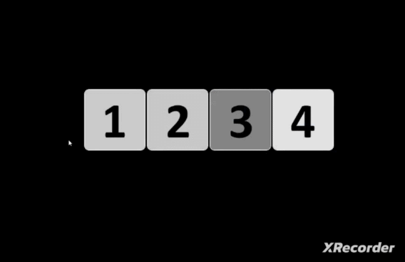
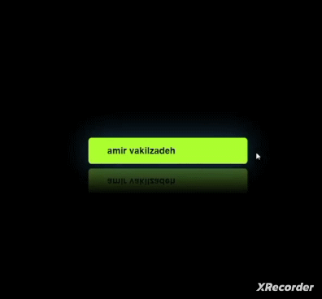

<h2><a href="https://github.com/amir-v-z/Mini-projects-Css/tree/main/boldImage">Bold Image</a></h2>

<h2><a href="https://github.com/amir-v-z/Mini-projects-Css/tree/main/searchBox">Search Box</a></h2>

#
> *__🌈 If you enjoyed...🔥__*

> *__Don't forget to give stars🌟please😉🙏🏻__*